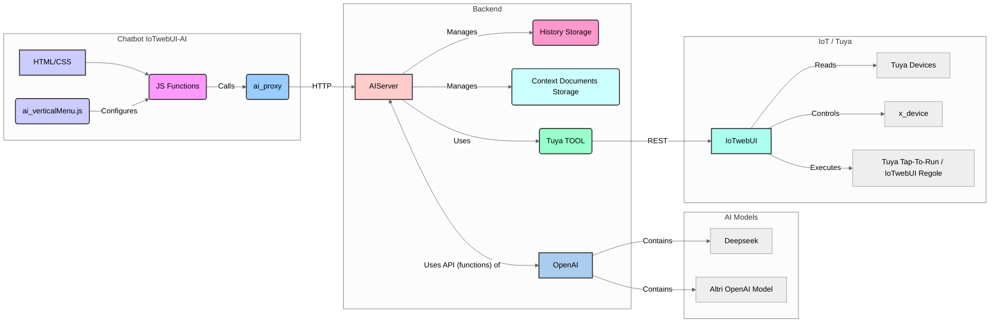

# IoTwebUI-AI

**Introduction:** 
[Versione italiana](https://github.com/msillano/IoTwebUI/blob/main/IoTwebUI%20AI/LEGGIMI.md)

This document introduces the **IoTwebUI-AI** project, a general-purpose chatbot integrated with the Tuya ecosystem.
This versatile environment has been developed to allow more adventurous users to explore and experiment with artificial intelligence's (AI) potential in combination with IoT devices from the **IoTwebUI** extension. The main objective is to provide a flexible tool for conducting tests and analyses, interacting with existing IoT devices, and experimenting with AI's potential in this context.

### Primary Objective: Experimentation of AI and Integration with Tuya

The primary objective of **IoTwebUI-AI** is experimentation with different artificial intelligence configurations (models), with direct management of context, conversation history, and tools (TOOLs) to analyze and interact with Tuya devices. This includes:

* **Assisted Documentation:** Leveraging AI to generate documentation, summaries, or analyses based on device information.
* **Assisted Automation:** Leveraging AI to generate algorithms and automations to manage complex situations that are not immediately solvable, taking into account the constraints of Tuya 'scenes'.
* **Assisted Maintenance:** Another area where AI's contribution can bring benefits in terms of optimizations and savings.
* **Exploration of Future Applications:** Testing different interactions and automation,  combining the capabilities of **AI** with the control and management of **Tuya** + **IoTwebUI** devices.

In more detail, **IoTwebUI-AI** has been designed to test:

* **Optimization of Prompts and Interactions:** Experimenting with different instructions (prompts) to obtain the desired responses and actions from the AI in relation to IoT devices.
* **IoT Context Management:** Evaluating the effectiveness of integrating specific information about devices and their status into conversations with the AI.
* **Use of IoT Tools:** Developing and testing specific tools to interact with the Tuya ecosystem via AI (e.g., intelligent voice commands, automations based on AI analysis...).

### High-Level Architecture:

The **IoTwebUI-AI** chatbot is based on a modular architecture designed to maximize flexibility and simplify interaction with AI and Tuya devices:

1.  **AI Models (Cloud or Local):** The system can utilize many artificial intelligence models, mainly cloud-based, through the OpenAI API, to evaluate the different natural language processing capabilities and identify the best model for each task. The architecture is designed to potentially integrate local models as well.

2.  **OpenAI API (Unified Access Point):** Access to the various compatible AI models is through the standard OpenAI API interface, providing a consistent method for interacting with different artificial intelligences.

3.  **`ai_server` (Dedicated Local Server):** A local server, called "`ai_server`" and implemented with Express, acts as an intermediary between the user interface and the OpenAI API. This component manages:
    * Communications with the OpenAI API, including request formatting and response handling.
    * Accessory functionalities such as conversation history storage and the management of context information to be used.
    * Support for multiple user sessions.
    * The implementation of specific TOOLs for interaction with the Tuya ecosystem via REST communications with **IoTwebUI**.

4.  **`ai_proxy` (Interface Library):** This JavaScript library provides a simplified interface for interacting with the "`ai_server`". It offers asynchronous functions that abstract the complex calls to the server, facilitating the development of the user interface. The main functions include the management of configuration, history, context, and calls to the OpenAI API (text and streaming).

5.  **JavaScript Functions for the User Interface:** A set of JavaScript functions (`IoTwebUIAI.js`) dedicated to the HTML interface handles:
    * Translating user actions into calls to the "`ai_proxy`" functions.
    * Managing the visual aspect of the interface and the presentation of information.
    * Performing format conversions such as Markdown and Mermaid for effective visualization.
    * Using the "`ai_verticalMenu.js`" module for managing the interface menus.

6.  **User Interface (HTML + CSS):** The user interface (`IoTwebUIAI.html`) is built with HTML and CSS for a flexible structure and style. Few JavaScript functions manage basic dynamic interactions, such as the collapsible menu.
    To facilitate customizations, the menu definition is in a separate file: "`ai_verticalMenu.js`".

### Flexibility and Power for Experimentation with Tuya and AI:

The IoTwebUI-AI chatbot offers considerable flexibility for experimentation in the field of IoT and AI, allowing direct user control of all major factors:

* **Dynamic Configuration:** The configuration of the AI model and access settings can be dynamically modified globally.
* **Independent Session and Model Management:** Each user session operates independently, allowing for simultaneous testing of different configurations.
* **Context and History per Session:** Context information related to Tuya devices and conversation history are managed for each session.
* **Automatic Cleaning:** Session data (history, context) is automatically deleted after 24 hours.
* **Advanced Integration with Tuya:** One of the key features is the integration of specific **TOOLs** for interacting with the Tuya ecosystem. This allows:
    * Access the status and information of real and virtual _Tuya devices_ and _IoTwebUI x-devices_.
    * Send commands to devices (_"tap-to-run" Tuya_ and _IoTwebUI "RULES"_).
    * Directly update the status values of _IoTwebUI x-devices_.
    * Develop intelligent automation scenarios based on AI analysis of device data.
    * Experiment with new human-machine interaction modes for managing smart homes and other IoT devices.
    
### AI Providers

An OpenAI-compatible API interface is required. Currently, I have tested:

#### Groq
    Free plan (with access limitations): see https://groq.com/ to get APIKEY
        rate limits here: https://console.groq.com/docs/rate-limits
    AccessPoint: https://api.groq.com/openai/v1
    Models: 9 (Whisper, llama..) see https://console.groq.com/docs/models
    note: groq-llama3.3 (meta) implements tools and is very fast
    
#### Deepseek
    Pay-as-you-go: https://www.deepseek.com/ to get APIKEY
        e.g., April '25: 1250 API requests, 3,500,000 Tokens = 0.64 USD
    AccessPoint: https://api.deepseek.com
    Models: 2 (deepseek-chat, deepseek-reasoner) see https://api-docs.deepseek.com/quick_start/pricing
    
#### OpenAI
    Pay-as-you-go: see https://openai.com/api/pricing/ to get APIKEY
    AccessPoint: https://api.openai.com/v1
    Models: 10+ (ChatGPT-4o, DALL·E 3...) see https://platform.openai.com/docs/models

_note: there are various usage limitations, e.g., the implementation of TOOLs, but also the number of communications or the size of attached documents, which vary from model to model and are obviously more restrictive in free plans._
_note: the side menu is dynamic and easily customizable: for example, adding/removing models is very simple (see file `ai_verticalMenu.js`)._

### Potential Future Developments

The experience gained and the specifications defined through experimentation with **IoTwebUI-AI** may in the future be used for the development of specialized AI + applications, focused on specific interactions with Tuya devices or on particular analyses of IoT data.

### _Conclusion:_

_The IoTwebUI-AI project represents a versatile and powerful experimentation environment for exploring the synergies between artificial intelligence and the Tuya ecosystem. Its flexible architecture and the integration of specific TOOLs offer technicians the ability to analyze IoT devices, experiment with new interactions, and lay the foundations for future intelligent applications._

For usage and installation, see [chatbot](https://github.com/msillano/IoTwebUI/blob/main/IoTwebUI%20AI/chatbot/README.md)

  
OpenSource Project, MIT License, (c)2025 marco sillano

IoTwebUI and IoTwebUI AI are works in progress. They are provided "as is"without warranties of any kind, implicit or explicit.

