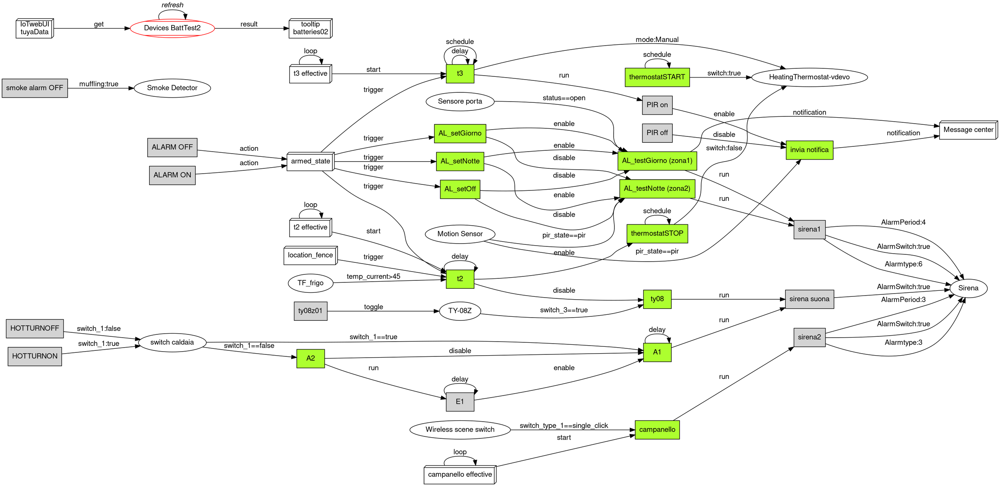

# Tuya patterns for scenes

La creazione di **`scene`** Tuya è abbastanza semplice: una serie di interfacce e menu guidano l'utente alla creazione di **`tap_to_run`** (attivate da comando manuale o da altre `scene`, senza condizioni)   ed **`automazioni`** (attivate - triggerate - da condizioni su eventi). 

Non sono sempre rose e fiori: una serie di `quirk` nell'implematazione di Tuya possono creare problemi all'utente nei casi più semplici, mentre i limiti imposti (mancanza di ELSE, di variabili, di operazioni aritmetiche, etc..) possono costringere a cercare soluzioni alternative nei casi appena più complessi, oppure possono rendere indispensabile l'uso di **IoTwebUI**.

## principali quirk

#### condizioni
1) Le **condizioni** attivano le azioni collegate una sola volta, appena la condizione è raggiunta (cioè quando la condizione passa da FALSO a VERO - edge triggering). Perchè altrimenti sarebbe impossibile la coesistenza tra comandi automatici e manuali. (vedi https://support.tuya.com/en/help/_detail/K9hutqbuwhik3)
2) Condizioni in **AND**: (= tutte) attivano l'azione (trigger) quando diventano TUTTE vere (cioè quando l'ultima condizione passa da FALSO a VERO e tutte le altre sono già VERE)
3) Condizioni in **OR**: (= almeno una) sono indipendenti (cioè si ha un trigger ogni volta che una condizione passa da FALSO a VERO, a prescindere dalle altre). 

#### ambito
Vincoli logici aggiuntivi che non provocano azioni (non sono trigger) ma DEVONO essere VERI (level) per avere un trigger dalle condizioni

#### disabilitare automazioni
Una `automazione disabilitata`  ovviamente NON si avvia, a prescindere dalle condizioni + ambito. 
Se si disabilita una `automazione` in corso di esecuzione, questa interrompe l'esecuzione prima del task successivo. 
Qualche problema si crea nel caso di una disabilitazione seguite da riabilitazione durante l'esecuzione di un delay. Una disabilitazione viene onorata al termine del delay in corso. Se però interviene una riabilitazione prima del termine del delay, il comportamento può variare: in alcuni casi l'esecuzione abortisce (Zigbee) correttamente in altri, invece, _NON abortisce, ignorando completamente la disabilitazione_! E' quindi una situazione da evitare, perchè NON affidabile!

## HW workaround
Talora è necessario ovviare all'assenza di varibili o ad altri limiti del linguaggio utilizzando device (reali o virtuali) come semaforo (1 bit di memoria) o come timer (usando la funzione countdown) etc.. e questo complica ovviamente la scene.

## Tuya pattern
Alcuni problemi si presentano simili in applicazioni diverse. In questi casi, una valida soluzione generale è chiamata 'pattern' e si presta a essere utilizzata più e più volte.
Questa è una collezione di pattern per scene Tuya, spesso nati e discussi nel [gruppo TuyaItalia](https://www.facebook.com/groups/tuyaitalia?locale=it_IT) poi sviluppati e documentati con l'aiuto di varie AI.

#### contesti
Per i pattern sono presi in considerazione 3 contesti

1) **local linkage**: scene Tuya che possono essere eseguite dirattamente dall'HUB e da device Zigbee, senza uso del WiFi e di TuyaCloud. Comporta alcuni limiti alle condizioni e azioni utilizzabili, oltre al vincolo di tutte device Zigbee e all'impossibilitòà di usare device virtuali ed ambito. _LAN linkage_ è analogo come vincoli e prestazioni ma coinvolge più HUB Zigbee e richiede il WiFi. 
Da preferire per un sistema affidabile e robusto.

2) **Cloud linkage**: tutte le scene valide in Tuya, con uso del Cloud, etc.  
Poggiandosi sul Cloud, richiedono un WiFi affidabile 24/7

3) **REGOLE di IoTwebUI**: le REGOLE sono l'equivalente delle 'scene' Tuya. Utilizzano, per semplificare, MACRO potenti, e sono scritte in un'dialetto' javascript. Sono 'Turing complete'. In certe APP sono indispensabili (e.g. Thermostat, pieno di operazioni aritmetiche!), nei pattern in 

genere rappresantono una semplice e potente alternativa.  
Dipendono dall'esecuzione di **IoTwebUI** su un server, sono qundi la soluzione meno robusta. 
