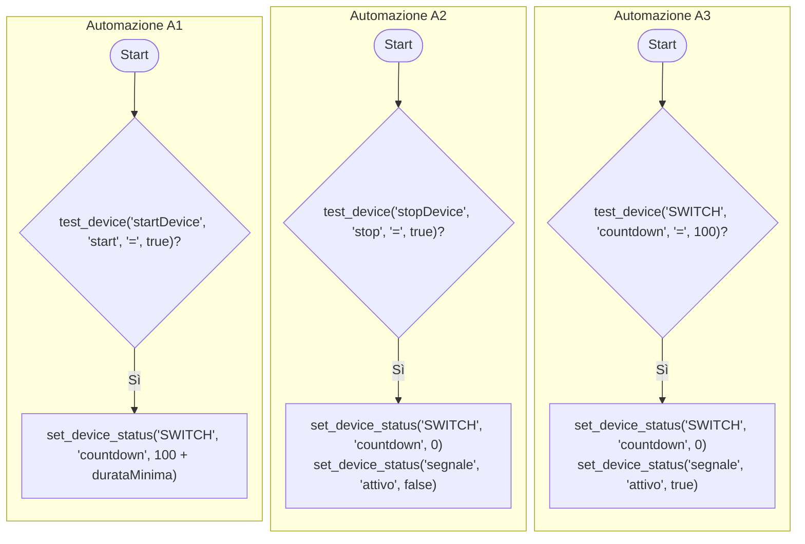

### Pattern 
_Filtro per eventi brevi_


### Spiegazione del Pattern e Implementazioni

**Modello Concettuale**  
Rileva quando un evento inizia (`startDevice.start = true`) e termina (`stopDevice.stop = true`). Se la durata supera `durataMinima`, attiva un'azione (`segnale.attivo = true`).

**Esempi**
*  Un messaggio "Per favore, chiudere la porta!" se una porta resta aperta per più di 4 minuti.
*  Una notifica se il consumo di casa supera 3.3 KW per più di 10 minuti

---
### Implementazione 1 ('local linking' con Switch Zigbee)
**Device**: _Switch Zigbee (SWITCH) con funzione countdown. Le altre funzioni dello switch (ON/OFF, etc.) possono essere usate in modo indipendente per altri scopi_.

**Codice**

```
// Automazione A1
SE (test_dispositivo(startDevice, start, =, true))
POI (set_device_status(SWITCH, countdown, xxx))    // Nota: xxx va sostituito con (100 + durataMinima) 

// Automazione A2
SE (test_dispositivo(stopDevice, stop, =, true))
POI (set_device_status(SWITCH, countdown, 0), set_device_status(segnale, attivo, false))

// Automazione A3
SE (test_dispositivo(SWITCH, countdown, =, 100))
POI (set_device_status(SWITCH, countdown, 0), set_device_status(segnale, attivo, true))
```



**Logica**:  

1. **Avvio Timer**:  
   - All'evento di start, imposta il countdown a `100 + durataMinima` secondi.  
   - Esempio: Se `durataMinima = 240s` (4 minuti), il countdown parte da **340s**.  
2. **Interruzione**:  
   - Se arriva lo stop, il countdown viene resettato a **0** (annulla il timer) e l'output a "false".  
3. **Trigger dell'Azione**:  
   - Quando il countdown raggiunge **100**, significa che sono trascorsi `durataMinima` secondi (es. 340 - 100 = 240s).  
   - A questo punto, attiva `segnale.attivo` e resetta il timer.

<br>
<b>A</b>: Input &nbsp; <b>B</b>: Output &nbsp; <b>C</b>: Countdown > 0 

**Vantaggi**:  
- **Affidabile**: Funziona offline, senza dipendenze cloud, con sensori Zigbee.  
- **Generale**: Funziona anche con sensori WiFI, in questo caso oviamente usa TuyaCloud.  
- **Reattivo**: Gestisce correttamente interruzioni e riavvii.

nota: se è complesso inserire in SmartLife un countdown di 100 (s), usate pure i minuti: 120 = 2 minuti; ritardo 240s = 4 minuti, totale 6 minuti.
---

### Implementazione 2 ('local linking' con Switch Zigbee)
**Device**:  
- **Switch Zigbee (MASTER)**: Utilizzato come dispositivo centrale per l'allarme.  
  - Proprietà: `countdown()` (timer retriggerabile, valore > 0 per avviare, 0 per annullare).
                         quando arriva a 0 effettua il TOGGLE di  MASTER.switch_1. 
  - Output: `MASTER.switch_1 == true` indica l'attivazione dell'allarme.  
---

**Codice**  
``` 
// Automazione A1: Avvia timer all'apertura della porta
A1:
SE (trigger(test_dispositivo(startDevice, start, =, true)))
POI (
    set_device_status(MASTER, countdown, 80),  // Imposta timer a 80s (valore > 0)
    set_device_status(MASTER, switch_1, false)  // Resetta l'allarme
)

// Automazione A2: Interrompi timer alla chiusura della porta
A2:
SE (trigger(test_dispositivo(stopDevice, stop, =, true)))   // or: (startDevice, start, =, false)
POI (
    set_device_status(MASTER, countdown, 0),    // Annulla timer
    set_device_status(MASTER, switch_1, false)  // Resetta allarme
)
```

---

```mermaid
flowchart TD
    A[Apertura Porta] -->|trigger(startDevice.start=true| A1
    A1 -->|set MASTER.countdown(80)| B[Timer Avviato]
    B -->|Scaduto| C{{MASTER.switch_1=true}} --> D[Allarme Attivo]
    A[Chiusura Porta] -->|trigger(stopDevice.stop=true| A2
    A2 -->|set MASTER.countdown(0)| E[Timer Annullato] --> F[Allarme Disattivato]
```

---

**Logica**:  
1. **Avvio Timer**:  
   - Quando la porta viene aperta (`startDevice.start=true`), A1:  
     - Imposta `MASTER.countdown=80` (80 secondi).  
     - Resetta `MASTER.switch_1` per evitare attivazioni accidentali.  
   - Il countdown è **retriggerabile**: ogni nuovo start sovrascrive il timer precedente.  

2. **Scadenza Timer**:  
   - Se il timer raggiunge **0** (dopo 80s), il MASTER imposta automaticamente `switch_1=true`, attivando l'allarme.  

3. **Interruzione Timer**:  
   - Se la porta viene chiusa (`stopDevice.stop=true`), A2:  
     - Resetta il timer a **0**, annullandolo.  
     - Disattiva l'allarme (`switch_1=false`).  
---

**Vantaggi**:  
- **Gestione pulita del timer**:  
  - `countdown()` gestisce internamente la logica temporale, evitando azioni manuali.  
  - Il reset a **0** previene falsi trigger (es. toggle da 1→0).  
- **Retriggering integrato**:  
  - Ogni apertura riavvia il timer, garantendo che l'allarme scatti solo dopo 80s di inattività.  

**Note Tecniche**:  
- **Calibrazione tempo**: Il valore `80` nel codice corrisponde a 80 secondi (Si può usare anche 01:20 se più facile in SmartLife).  
- **Dispositivi**: `startDevice` e `stopDevice` possono essere sostituiti con lo stesso sensore porta (es. `sensoreport.aperto` → `start=true` e `stop=false`).
---

### Implementazione 3 (REGOLE di IoTwebUI)

**Vantaggi**
* `startDevice` e `stopDevice` sono un'unica device: si misura la durata dello stato 'TRUE' (e.g. "Sensore porta.doorcontact_state")
* La potenza delle REGOLE e delle MACRO rende molto semplice e compatto il codice necessario
* `VOICE()` permette di utilizzare messaggi vocali in modo intuitivo.
* Le azioni immediate disponibili sono, oltre a VOICE(testo): beep, pop-up(testo), suona(file), esegui(tap_to_run)


**Codice**

```
if(ISTRIGGERH( CONFIRMH( GET("Sensore porta", "doorcontact_state") , "04:00"))) VOICE("chiudere la porta, grazie");
```

**Spiegazione**
* **GET** (`device`, `attributo`) è una MACRO che ritorna lo `stato` di `device.attributo` (VERO/FALSO)
* **CONFIRMH** (`evento`, `durata`) è una MACRO che ritorna vero solo se `evento` è H (VERO) per almeno il tempo `durata`, altrimenti ignora evento.
* **ISTRIGGERH** (`evento`) è una MACRO che trasforma un evento in _trigger_: è cioè VERO per un solo run, quando `evento` passa da FALSO a VERO.
* **if** (`condizione`) `azione` è il costrutto usuale js (può avere `else`)
* **VOICE** (`testo`) è una MACRO che pronuncia il `testo` nella lingua di default. <br>
Vedi [documentazione di riferimento](https://github.com/msillano/IoTwebUI/blob/main/LEGGIMI30.md#macro-per-risorse) per le MACRO.

**Svantaggi**:  
- **Latenza**: A causa dei vari tempi di polling, può presentare ritardi che lo rendono inadatto a tempi troppo brevi  
- **Server**: Richiede IoTwebUI in funzione.

---
### Esempi Pratici
1. **Porta Aperta**:  
   - Implementazione 1: Lo switch Zigbee conta 340s. Se la porta viene chiusa prima di 240s, il timer si annulla. A 100s rimanenti (240s trascorsi), parte l'allarme.  
   - Implementazione 2: Un messaggio vocale avverte che la posta è aperta dopo 5.5 minuti (+/- 90s)
   

2. **Consumo Elettrico**:  
   - Analogamente, se il consumo supera 3.3KW per >10 minuti, la notifica avviene solo dopo il superamento della durata minima.

---

### Raccomandazioni
- **Preferire Implementazione 1** (Zigbee) se possibile: più robusta e immediata.  
- Se si usa già per altri motivi **IoTwebUI** (e.g. menu di interfaccia in un tablet) prendere in considerazione la **Implementazione 2** perchè più adattabile.
