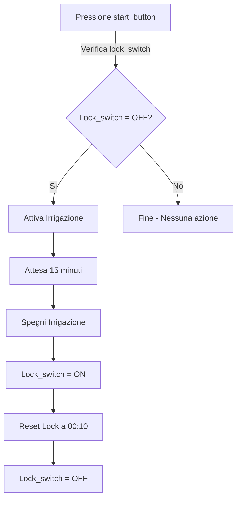
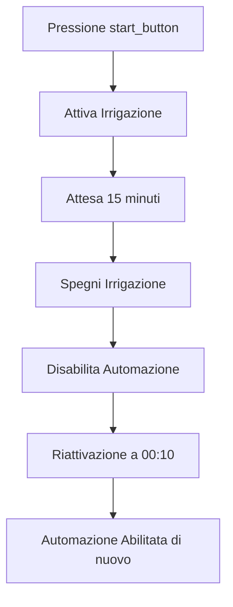

### Pattern 
_single run_


### Spiegazione del Pattern e Implementazioni

**Modello Concettuale**  
Una serie di attività da eseguire al massimo una volta al giorno

**Esempio**
*  irrigazione: Un ciclo di irrigazione (e.g. 15 minuti) da eseguire su comando dell'utente, magari solo se non piove.
---

### Implementazione 1 ('local linkage' e Switch Zigbee)
**Device**: <br>
_Switch Zigbee (switch_acqua) con funzione di master_. <br>
_Scene Switch Zigbee (start_button) con di user start_. <br>
_extra: Switch Zigbee (lock_switch) con funzione di signal_

**Codice**

```
Attivazione Irrigazione: 
SE (trigger(test_dispositivo(start_button, switch1, =, short)) 
   AND test_dispositivo(lock_switch, switch1, =, OFF)) 
POI (
    set_device_status(lock_switch, switch1, ON)
    set_device_status(switch_acqua, switch1, ON),
    set_ritardo(900),                             // 900s = 15 minuti
    set_device_status(switch_acqua, switch1, OFF),
)

Reset Lock: 
  SE (trigger(giorno_orario_definito(00:10, tutti i giorni))) 
  POI (
    set_device_status(lock_switch, switch1, OFF)
)
```


**Logica**: 
 
**Fine**:
```mermaid
```

**Vantaggi**:  

---

### Implementazione 2 (Cloud linkage)

**Device**:
_Switch Zigbee (switch_acqua) con funzione di master_. <br>
_Scene Switch Zigbee (start_button) con di user start_. <br>

**Codice**

```
Attivazione Irrigazione: 
 SE (trigger(test_device(start_button, switch1, short))) 
 POI (
    set_device_status(switch_acqua, ON, 1),
    set_ritardo(900s),
    set_device_status(switch_acqua, OFF, 0),
    disabilita_automazione(Attivazione Irrigazione)
)

riattiva_sequenza: 
SE (trigger(giorno_orario_definito(00:10, tutti i giorni)))
 POI (
    abilita_automazione(attiva_sequenza)
)
```
**Logica**: 
 
**Fine**:

```mermaid
```

**Vantaggi**:  

---

### Pattern
_single run_

### Spiegazione del Pattern e Implementazioni

**Modello Concettuale**  
Una serie di attività da eseguire al massimo una volta al giorno

**Esempio**
*  irrigazione: Un ciclo di irrigazione (e.g. 15 minuti) da eseguire su comando dell'utente, magari solo se non piove.

---

### Implementazione 1 ('local linkage' e Switch Zigbee)
**Device**: <br>
_Switch Zigbee (switch_acqua) con funzione di master_. <br>
_Scene Switch Zigbee (start_button) con funzione di user start_. <br>
_extra: Switch Zigbee (lock_switch) con funzione di signal_

**Codice**
```tuya
Attivazione Irrigazione:
SE (trigger(test_dispositivo(start_button, switch1, =, short))
   AND test_dispositivo(lock_switch, switch1, =, OFF))
POI (
    set_device_status(lock_switch, switch1, ON),
    set_device_status(switch_acqua, switch1, ON),
    set_ritardo(900),                             // 900s = 15 minuti
    set_device_status(switch_acqua, switch1, OFF)
)

Reset Lock:
  SE (trigger(giorno_orario_definito(00:10, tutti i giorni)))
  POI (
    set_device_status(lock_switch, switch1, OFF)
)
```

**Logica**:  
1. L'utente preme il pulsante di avvio (start_button).
2. Se il sistema non è bloccato (lock_switch = OFF), avvia l'irrigazione.
3. L'irrigazione dura 15 minuti (900 secondi).
4. Dopo il tempo stabilito, il sistema spegne l'irrigazione.
5. Il sistema si sblocca automaticamente a mezzanotte e 10 minuti per consentire una nuova attivazione il giorno successivo.

**Diagramma di Flusso**:


**Vantaggi**:
- **Funzionamento locale**: l'automazione avviene senza necessità di connessione internet.
- **Sicurezza**: l'uso del `lock_switch` previene attivazioni multiple nello stesso giorno.
- **Affidabilità**: indipendente da eventuali problemi di rete.

---

### Implementazione 2 (Cloud linkage)
**Device**:
_Switch Zigbee (switch_acqua) con funzione di master_. <br>
_Scene Switch Zigbee (start_button) con funzione di user start_. <br>

**Codice**
```tuya
Attivazione Irrigazione:
 SE (trigger(test_device(start_button, switch1, short)))
 POI (
    set_device_status(switch_acqua, ON, 1),
    set_ritardo(900s),
    set_device_status(switch_acqua, OFF, 0),
    disabilita_automazione(Attivazione Irrigazione)
)

Riattiva Sequenza:
SE (trigger(giorno_orario_definito(00:10, tutti i giorni)))
 POI (
    abilita_automazione(Attivazione Irrigazione)
)
```

**Logica**:  
1. L'utente preme il pulsante di avvio (start_button).
2. Il sistema attiva l'irrigazione per 15 minuti.
3. Dopo il tempo stabilito, l'irrigazione viene disattivata.
4. L'automazione viene disabilitata per evitare nuove attivazioni nello stesso giorno.
5. A mezzanotte e 10 minuti, l'automazione viene riattivata per consentire una nuova attivazione il giorno successivo.

**Diagramma di Flusso**:


**Vantaggi**:
- **Maggiore flessibilità**: la gestione via cloud consente aggiornamenti e modifiche da remoto.
- **Più semplice**: non richiede dispositivi aggiuntivi come `lock_switch`.
- **Compatibile con altre automazioni cloud**.

---

### Raccomandazioni
- **Usare Local Linkage** se la priorità è l'affidabilità e si vuole evitare dipendenze dalla connessione internet.
- **Usare Cloud Linkage** se si desidera più flessibilità nella gestione da remoto e non si ha timore di eventuali interruzioni della rete.
- In entrambi i casi, verificare che i dispositivi supportino la logica scelta e testare la configurazione prima della messa in uso definitiva.


### Raccomandazioni
