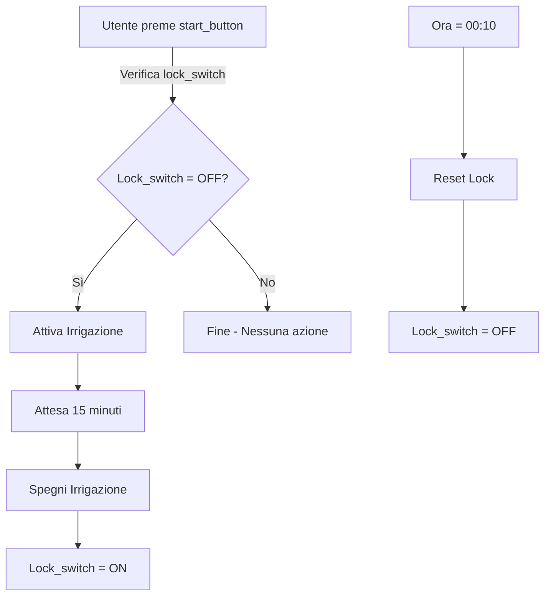
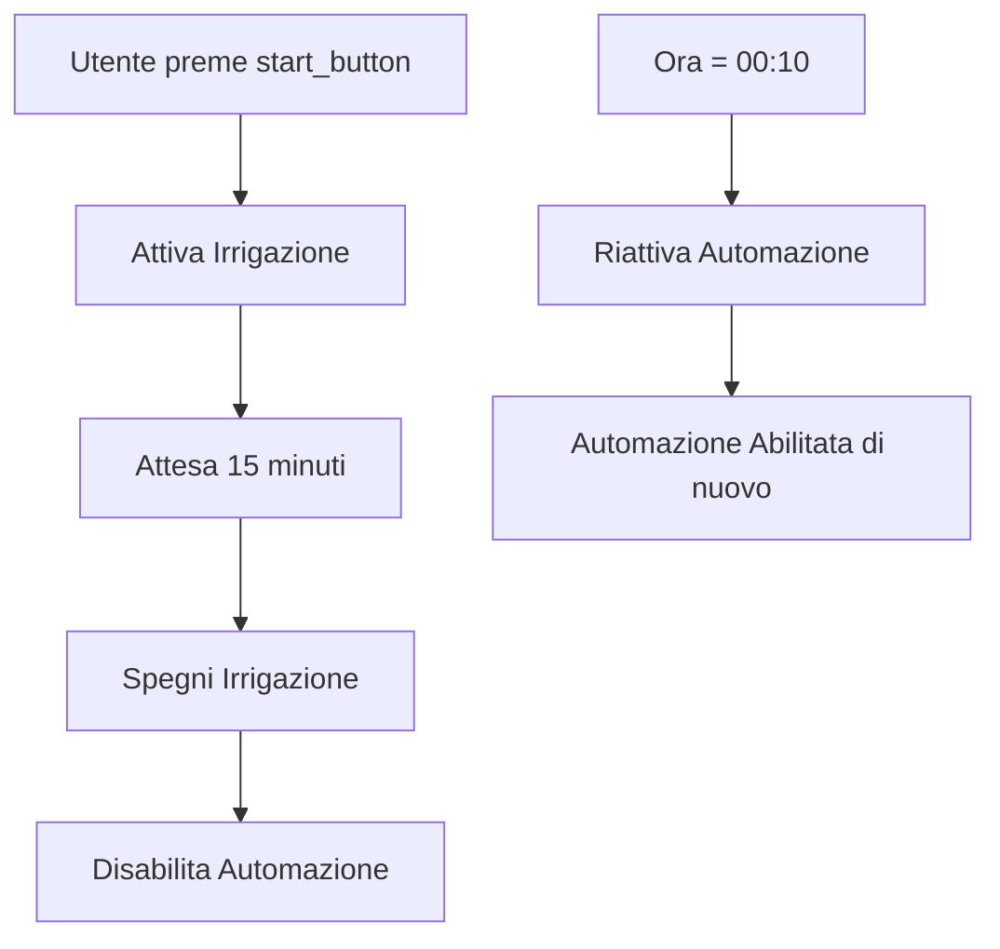

### Pattern

*single run*

### Spiegazione del Pattern e Implementazioni

**Modello Concettuale**\
Una serie di attività da eseguire al massimo una volta al giorno

**Esempio**

- irrigazione: Un ciclo di irrigazione (e.g. 15 minuti) da eseguire su comando dell'utente, magari solo se non piove.

---

### Implementazione 1 ('local linkage' e Switch Zigbee)

**Device**:&#x20;
*Switch Zigbee (switch\_acqua) con funzione di master*.&#x20;
*Scene Switch Zigbee (start\_button) con funzione di user start*.&#x20;
*extra: Switch Zigbee (lock\_switch) con funzione di signal*

**Codice**

```tuya
Attivazione Irrigazione:
SE (trigger(test_dispositivo(start_button, switch1, =, short))
   AND test_dispositivo(lock_switch, switch1, =, OFF))
POI (
    set_device_status(lock_switch, switch1, ON),
    set_device_status(switch_acqua, switch1, ON),
    set_ritardo(900),                             // 900s = 15 minuti
    set_device_status(switch_acqua, switch1, OFF)
)

Reset Lock:
  SE (trigger(giorno_orario_definito(00:10, tutti i giorni)))
  POI (
    set_device_status(lock_switch, switch1, OFF)
)
```

**Diagrammi di Flusso**:



---

### Implementazione 2 (Cloud linkage)

**Device**:
*Switch Zigbee (switch\_acqua) con funzione di master*.&#x20;
*Scene Switch Zigbee (start\_button) con funzione di user start*.&#x20;

**Codice**

```tuya
Attivazione Irrigazione:
 SE (trigger(test_device(start_button, switch1, short)))
 POI (
    set_device_status(switch_acqua, ON, 1),
    set_ritardo(900s),
    set_device_status(switch_acqua, OFF, 0),
    disabilita_automazione(Attivazione Irrigazione)
)

Riattiva Sequenza:
SE (trigger(giorno_orario_definito(00:10, tutti i giorni)))
 POI (
    abilita_automazione(Attivazione Irrigazione)
)
```

**Diagrammi di Flusso**:



---

### Raccomandazioni

- **Usare Local Linkage** se la priorità è l'affidabilità e si vuole evitare dipendenze dalla connessione internet.
- **Usare Cloud Linkage** se si desidera più flessibilità nella gestione da remoto e non si ha timore di eventuali interruzioni della rete.
- In entrambi i casi, verificare che i dispositivi supportino la logica scelta e testare la configurazione prima della messa in uso definitiva.

