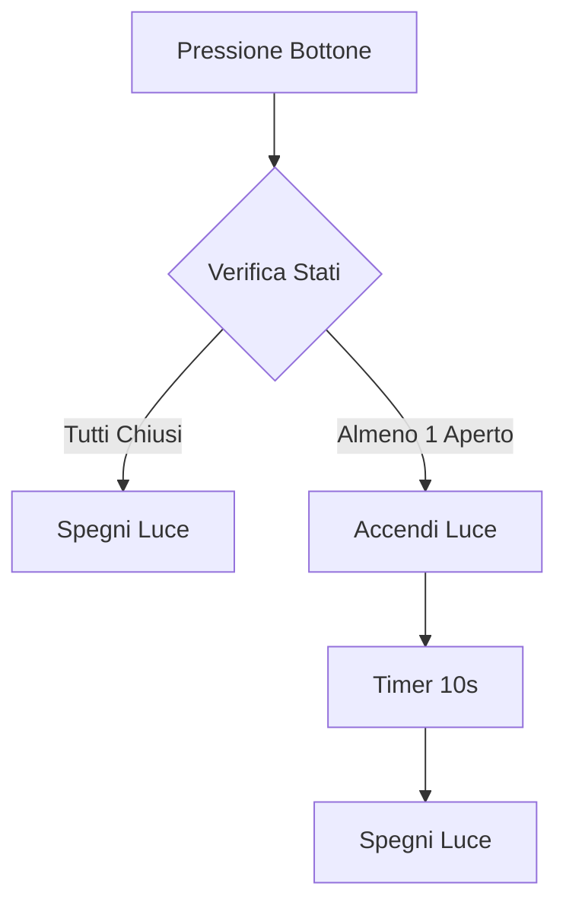

### Pattern  
_Test di stato sensori_  

### Spiegazione del Pattern e Implementazioni  

**Modello Concettuale**  
Si vuole verificare lo stato di una serie di sensori su richiesta dell'utente o in base a una condizione specifica. L'obiettivo è eseguire un'azione (ad esempio, accendere una luce rossa) se almeno uno dei sensori rileva uno stato particolare (ad esempio, una finestra o una porta aperta). Differisce dall'allarme tradizionale perché non utilizza trigger event-driven, ma verifica attivamente gli stati su richiesta.

---

### Implementazione 1 (Tuya-full)  

**Device**:  
- Bottone smart (Tuya) per avviare il test  
- Sensori porta/finestra (Tuya)  
- Luce RGB (Tuya) come indicatore  

**Codice**:  
```
test_sensori:
  SE (trigger(test_device("Switch", "button1", "=", 'single_clic')) 
    AND ambito(
      test_device("sensore1", "Sensore porta", "=", On) 
      OR test_device("sensore2", "Sensore porta", "=", On)
    ))
  POI (
    set_device_status("Luce rossa", "switch", ON),
    ritardo(00:00:10),
    set_device_status("Luce rossa", "switch", OFF)
  )
```

**Logica**:  
1. **Trigger**: Attivazione manuale tramite pressione pulsante  
2. **Ambito**: Verifica OR tra stati dei sensori tramite funzione nativa  
3. **Azione**: Segnale visivo temporizzato (10 secondi)  

**Vantaggi**:  
- Implementazione centralizzata con singola automazione  
- Utilizzo efficiente della funzione AMBITO per logica complessa  
- Facile scalabilità con nuovi sensori  

**Svantaggi**:  
- Vincolato all'ecosistema Tuya-full  
- Dipendenza da cloud per elaborazione  

---

### Implementazione 2 (Tuya-local/Zigbee)  

**Device**:  
- Bottone smart Zigbee 
- Sensori Zigbee   
- Lampada rossa Zigbee 

**Codice**:  
```l
verifica_base:
  SE (trigger(test_device("Switch", "button1", "=", 'single_clic'))
    AND test_device("sensore1", "sensore1", "=", False)
    AND test_device("sensore2", "Sensore porta", "=", False))    // esempio: 2 sensori
  POI (
    set_device_status("lampada", "state", "OFF")
  )

allarme_sensore1:               // una automazione pèer sensore
  SE (trigger(test_device("Switch", "button1", "=", 'single_clic'))
    AND test_device("sensore1", "sensore1", "=", True))
  POI (
    set_device_status("Luce rossa", "switch", ON),
    ritardo(00:00:10),
    set_device_status("Luce rossa", "switch", OFF)
  )

allarme_sensore2:
  SE (trigger(test_device("Switch", "button1", "=", 'single_clic'))
    AND test_device("contact", "sensore2", "=", True))
  POI (
    set_device_status("Luce rossa", "switch", ON),
    ritardo(00:00:10),
    set_device_status("Luce rossa", "switch", OFF)
  )
```

**Logica**:  
1. **Architettura decentralizzata**: Automazione separata per ogni sensore  
2. **Trigger combinato**: Pressione pulsante + stato sensore specifico  
3. **Gestione stati**:  
   - Reset luce quando tutti i sensori sono chiusi  
   - Attivazione per ogni sensore compromesso  

**Vantaggi**:  
- Funziona offline con HUB Zigbee locale  
- Maggiore controllo granulare  

**Svantaggi**:  
- Manutenzione complessa (N+1 automazioni)  
- Logica ridondante tra automazioni  
- Limitata scalabilità con molti sensori  

---

### Raccomandazioni  

1. **Scelta Implementazione**:  
   - Preferire Tuya-full per installazioni piccole/medie (<10 sensori)  
   - Optare per Tuya-local/Zigbee in scenari critici che richiedono offline operation  

2. **Best Practice**:  
   - Implementare timeout automatico (es. spegnimento luce dopo 10s)  
   - Utilizzare naming convention espliciti (es. "btn_test_sicurezza")  

3. **Estensioni**:  
   - Aggiungere feedback acustico oltre a quello visivo  
   - Integrare notifiche push in caso di test positivo  
   - Registrare log degli stati per diagnostica  



